## À propos

**Data engineer**, je construis la chaîne complète : ingestion, transformation, modélisation, stockage, jusqu'à ce que les données permettent d'analyser.

- **Je montre le système, pas seulement le résultat** : sources, pipeline, modèle de données, contrôles qualité.
- **Reproductible** : chaque pipeline se relance en une commande et se rejoue en intégration continue.
- **Testé** : chaque particularité découverte en explorant les données devient un test automatique.
- **Documenté** : README, catalogue de données, conventions de nommage, schémas d'architecture.

Mon parcours en développement full stack m'aide à comprendre comment les données circulent jusqu'à l'application qui les utilise.

## Projets

  
  

  

**Prénoms de France** · 126 ans de naissances : ingestion traçable (sha256, contrôle du schéma), modèle dbt en trois couches, 39 tests de qualité, intégration continue, export JSON pour une page interactive.
**Entrepôt de données SQL** · *projet guidé (cours Data With Baraa), adapté en français* : données CRM et ERP consolidées en bronze, silver et gold, jusqu'à un schéma en étoile et ses vues de reporting.
**Prix des carburants** · *en cours* : relevé quotidien des prix, historisation, station la moins chère autour de soi.

Autres projets : [**Inclusion financière**](https://github.com/Majin-M/inclusion_financiere) (prédiction de l'accès aux services bancaires en Afrique de l'Est, Random Forest, Streamlit) · [**Détection de visages**](https://github.com/Majin-M/Face-detection) (temps réel, OpenCV, Streamlit).

## Stack

  

  
  
  
  
  
  
  
  
  

## Activité

  

Visuels générés à partir des données réelles des projets.
