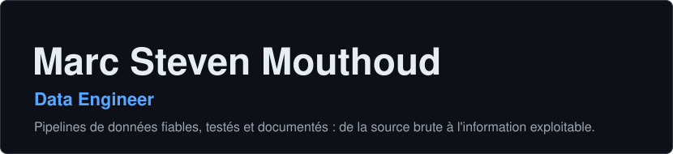
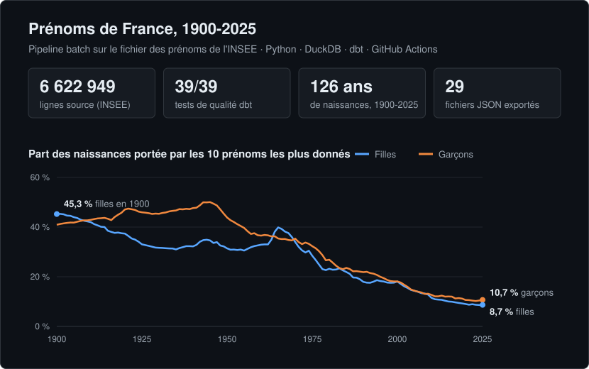

  
  
  

## À propos

Data Engineer, je conçois la chaîne de données de bout en bout : **ingestion, transformation, modélisation, stockage et restitution**.

- **Pipelines reproductibles** : relancés en une commande, rejoués en intégration continue.
- **Qualité testée** : les règles découvertes pendant l'exploration deviennent des tests automatiques.
- **Documentation** : README, catalogue de données, conventions de nommage, schémas d'architecture.

Mon expérience en développement full stack me donne une vision complète du parcours des données, jusqu'à l'application qui les utilise.

## Projets

**[Prénoms de France](https://github.com/Majin-M/prenoms_france)** · ingestion traçable (empreinte sha256, contrôle du schéma), modèle dbt en trois couches (raw, staging, marts), 39 tests de qualité, CI GitHub Actions, export JSON pour une page interactive.

**[Entrepôt de données SQL](https://github.com/Majin-M/sql-data-warehouse-project)** · *projet guidé (Data With Baraa), adapté en français* : données CRM et ERP consolidées en architecture Medallion, schéma en étoile, vues de reporting, contrôles qualité.

| Autres projets | Description | Stack |
|---|---|---|
| [Inclusion financière](https://github.com/Majin-M/inclusion_financiere) | Prédiction de l'accès aux services bancaires en Afrique de l'Est : analyse exploratoire, nettoyage, Random Forest, interface Streamlit | Python · Pandas · scikit-learn · Streamlit |
| [Détection de visages](https://github.com/Majin-M/Face-detection) | Détection de visages en temps réel, paramètres réglables | Python · OpenCV · Streamlit |

## Feuille de route

| Projet | Compétence visée | Statut |
|---|---|---|
| Prix des carburants | Ingestion quotidienne, historisation, géolocalisation | 🟡 En cours |
| Orchestration de pipelines | Airflow ou Dagster : planification, reprises, dépendances | ⚪ À venir |
| Data platform cloud | Stockage objet, entrepôt managé (Snowflake, Databricks) | ⚪ À venir |
| Streaming | Traitement de flux en temps réel (Kafka, Spark) | ⚪ À venir |

## Stack

| Domaine | Outils |
|---|---|
| **Langages** |     |
| **Transformation et qualité** |    |
| **Stockage et bases** |      |
| **Orchestration et big data** *(en apprentissage)* |     |
| **Cloud data** *(en apprentissage)* |   |
| **Restitution et API** |     |
| **DevOps et outils** |       |
| **Modélisation** | Modèle dimensionnel (faits, dimensions, clés de substitution) · MERISE · architecture Medallion |

## Activité

